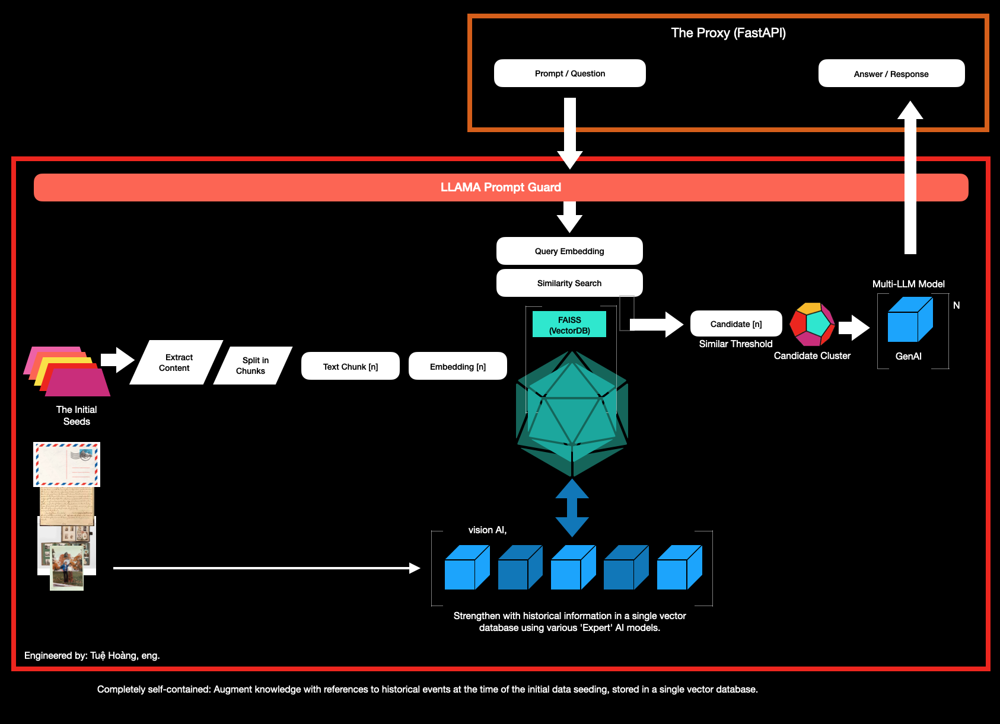
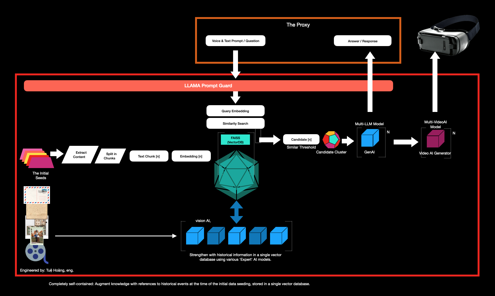

# ChronicleBridge: Fusing Personal Artifacts with Global Historical Insights

- Dare to Dream
- Inspire Bold Leadership
- Embrace Diversity in Thought and Innovation
- Explore together & unlock the world's knowledge

-------------------------------

**Abstract:** This proof of concept introduces an AI-powered, self-contained knowledge base designed to craft personalized historical timelines by integrating personal documents—such as letters, postal mail, stamp collections, card collections, old photographs, medical history and other personal artifacts—into a broader global historical context. By embedding these unique items into a unified vector database, the system weaves a detailed, chronological narrative that aligns personal milestones with significant global events. This approach not only preserves personal history but also enriches it, colouring individual experiences with the broader historical backdrop, allowing users to explore and reflect on the interconnectedness of their past with the world’s history.

----------------------------------

----------------------------------

Users can query this timeline to gain insights into the context surrounding their personal history, allowing them to explore relationships between personal events and global events, historical movements, or cultural shifts relevant to the time. The AI-powered model provides enriched responses to user prompts, offering background information, historical analysis, and potential insights about the world events that influenced or were contemporaneous with the seeded personal documents. This approach not only preserves individual history but also enhances understanding through the lens of broader historical developments, creating a powerful tool for historical inquiry and personal storytelling.

----------------------------------

### NEXT STAGE:

In addition to text-based insights, this system includes a video AI tool that recreates important historical moments, making the events related to a user’s personal documents come alive. Users can watch major world events as if they were happening alongside their own life milestones, creating an engaging and vivid experience. The AI provides background, historical analysis, and insights into world events that impacted or occurred at the same time as the user’s story. This tool preserves personal history while adding a rich historical context, making it an engaging platform for exploring history and personal storytelling.

